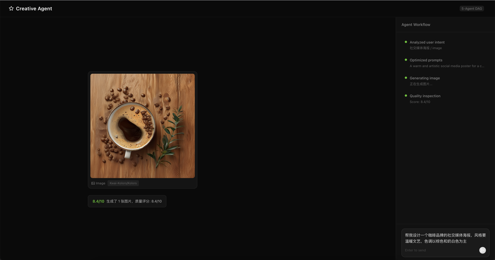

# AI Creative Agent Platform

基于多 Agent DAG 编排的 AI 创意生成平台，通过 5 个专业 Agent 协作完成图片/视频创意生成。

文生图：



图生视频:


## 核心特性

- **5 Agent DAG 编排**：Dispatcher -> PromptEngineer -> ImageGenerator -> QualityChecker -> VideoGenerator
- **设计技能模板**：社交媒体海报、品牌Logo、产品摄影、视频广告
- **图片生成**：SiliconFlow API（Kwai-Kolors/Kolors、Qwen/Qwen-Image）
- **视频生成**：文生视频(T2V) + 图生视频(I2V)（Wan-AI/Wan2.2-T2V-A14B、Wan-AI/Wan2.2-I2V-A14B）
- **质量闭环**：LLM 多维度质检，不达标自动重试（最多2次）
- **SSE 实时流**：全流程事件实时推送到前端

## 环境要求

| 依赖 | 版本 | 说明 |
|------|------|------|
| Python | 3.10+ | 后端 |
| Node.js | 18+ | 前端 |

无需 Docker、PostgreSQL、Redis 等基础设施，仅需 2 个 API Key。

## 快速启动

### 1. 配置后端环境变量

```bash
cd backend
cp .env.example .env
```

编辑 `.env`，填入 API Key：

```env
# 阿里云百炼 - LLM 调用（必填）
# 申请: https://bailian.console.aliyun.com/
DASHSCOPE_API_KEY=your-dashscope-api-key
LLM_BASE_URL=https://dashscope.aliyuncs.com/compatible-mode/v1

# 硅基流动 - 图片/视频生成（必填）
# 申请: https://cloud.siliconflow.cn/
SILICONFLOW_API_KEY=your-siliconflow-api-key
```

### 2. 启动后端

```bash
cd backend

# 安装依赖
pip install -r requirements.txt

# 启动（端口 8000）
cd app
python app_main.py
```

验证后端启动：

```bash
curl http://localhost:8000/hello
# 预期: {"status":"success","message":"Creative Agent Platform is running."}
```

API 文档：http://localhost:8000/docs

### 3. 启动前端

```bash
cd frontend

# 安装依赖
npm install --legacy-peer-deps

# 启动（端口 5183）
npm run dev
```

打开浏览器访问 http://localhost:5183/creative

## 测试

### 浏览器测试

访问 http://localhost:5183/creative ，在输入框中输入创意需求，或点击预设提示词。

### curl 测试

**纯图片生成：**

```bash
curl -X POST http://localhost:8000/creative/generate \
  -H "Content-Type: application/json" \
  -d '{"query": "帮我设计一个简约风格的咖啡品牌Logo"}' \
  --no-buffer
```

**图片 + 视频：**

```bash
curl -X POST http://localhost:8000/creative/generate \
  -H "Content-Type: application/json" \
  -d '{"query": "帮我设计一个咖啡品牌的社交媒体海报，并生成一段产品宣传视频"}' \
  --no-buffer
```

**纯视频：**

```bash
curl -X POST http://localhost:8000/creative/generate \
  -H "Content-Type: application/json" \
  -d '{"query": "帮我生成一段咖啡制作过程的视频广告"}' \
  --no-buffer
```

预期输出：一系列 SSE 事件 `data: {...}`，依次展示各 Agent 的工作过程，最终输出图片/视频 URL。

## 项目结构

```
backend/
  app/
    app_main.py                         # FastAPI 入口
    config/
      llm_config.py                     # LLM + Agent 模型配置
    router/
      creative_router.py                # POST /creative/generate
    service/
      creative_agent/                   # Creative Agent 模块
        state.py                        # CreativeState + 4个设计技能模板
        graph.py                        # DAG 工作流编排
        service.py                      # SSE 输出服务
        agents/
          dispatcher.py                 # 意图解析 Agent
          prompt_engineer.py            # 提示词优化 Agent
          image_generator.py            # 图片生成 Agent
          video_generator.py            # 视频生成 Agent
          quality_checker.py            # 质量检查 Agent
      deep_research_v2/
        agents/base.py                  # BaseAgent 基类（共享复用）
        state.py                        # ResearchState 类型定义
  .env                                  # 环境变量（2个API Key）
  requirements.txt                      # 7个Python依赖

frontend/
  src/
    App.tsx                             # 应用入口
    main.tsx                            # 渲染入口
    api/
      session.ts                        # creativeGenerate() SSE API
      request/                          # Axios 请求封装
    pages/
      creative/
        index.tsx                       # 创意生成页面
        index.module.scss               # 页面样式
    router/
      routes.tsx                        # / -> /creative
  .env                                  # VITE_API_BASE
```

## 架构

```
用户请求
  |
  v
DispatcherAgent（意图解析 + 场景匹配 + 设计技能选择）
  |
  v
PromptEngineerAgent（英文提示词优化 + 模型选择）
  |
  v
ImageGeneratorAgent（SiliconFlow 同步 API）
  |
  v
QualityCheckerAgent（5维度评分）
  |
  +--- 分数 < 7 --> 回到 PromptEngineerAgent（最多重试2次）
  |
  +--- 分数 >= 7 --> 需要视频？
                      |
                      +--- 是 --> VideoGeneratorAgent（异步提交 + 轮询）
                      |
                      +--- 否 --> 输出最终结果
```

### 架构决策

| 决策 | 选择 | 原因 |
|------|------|------|
| Agent 编排 | 手写 DAG（非 LangGraph） | 更轻量可控，无重依赖，但设计理念与 LangGraph StateGraph 一致，可平滑迁移 |
| Agent 间通信 | 共享 State（TypedDict） | 所有 Agent 读写同一个状态字典，简单直接，类似 LangGraph 的 channel 模式 |
| 流式输出 | asyncio.Queue + SSE | 单请求生命周期内的实时推送，零外部依赖；生产环境可替换为 Redis Stream |
| 质量控制 | LLM 驱动评分 + 自动重试 | 比硬编码规则更灵活，能理解语义层面的质量问题 |
| 视频生成 | 异步提交 + 轮询 | SiliconFlow API 限制，视频生成耗时 1-3 分钟，通过 SSE 推送进度避免前端超时 |
| BaseAgent 复用 | 继承 DeepResearch 基类 | 验证 Agent 框架的模态无关性：文本/图片/视频 Agent 共享同一套 LLM 调用、JSON 解析、消息队列能力 |

### SSE 事件类型

| 事件 | Agent | 说明 |
|------|-------|------|
| `creative_start` | - | 任务初始化 |
| `phase` | 各Agent | 当前阶段状态 |
| `intent_parsed` | Dispatcher | 解析出 task_type/scene/style/subject |
| `prompt_optimized` | PromptEngineer | 优化后的英文提示词 + 选定模型 |
| `image_generated` | ImageGenerator | 图片 URL |
| `quality_result` | QualityChecker | 5维度评分 + 建议 |
| `video_submitted` | VideoGenerator | 异步任务ID |
| `video_progress` | VideoGenerator | 轮询进度 |
| `video_generated` | VideoGenerator | 视频 URL |
| `creative_complete` | - | 最终结果汇总 |

### 技术栈

| 层级 | 技术 |
|------|------|
| 后端框架 | FastAPI + Uvicorn |
| LLM | 阿里云百炼（DeepSeek-V3.2）|
| 图片/视频 | SiliconFlow API |
| 前端框架 | React 19 + Vite + Ant Design |
| Agent 基类 | 复用 DeepResearch BaseAgent（call_llm / parse_json / SSE queue） |

## 常见问题

**Q: 图片生成返回 403？**
SiliconFlow 某些模型可能被禁用。当前可用：Kwai-Kolors/Kolors、Qwen/Qwen-Image

**Q: 视频生成很慢？**
视频生成是异步的，通常需要 1-3 分钟。SSE 流会实时推送轮询进度。

**Q: npm install 报错？**
使用 `npm install --legacy-peer-deps`

**Q: 后端启动报 ModuleNotFoundError？**
确保安装了依赖：`pip install -r requirements.txt`
